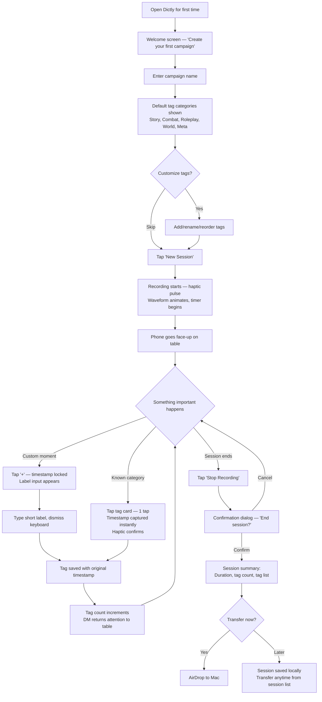
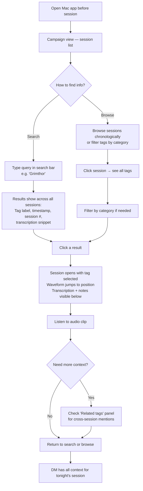
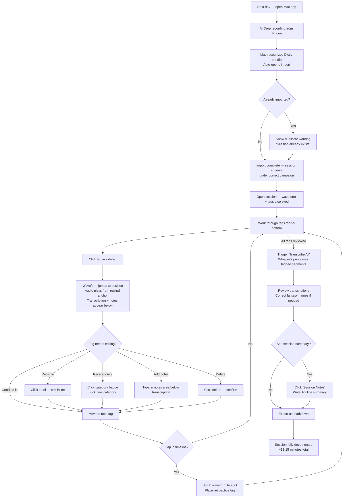
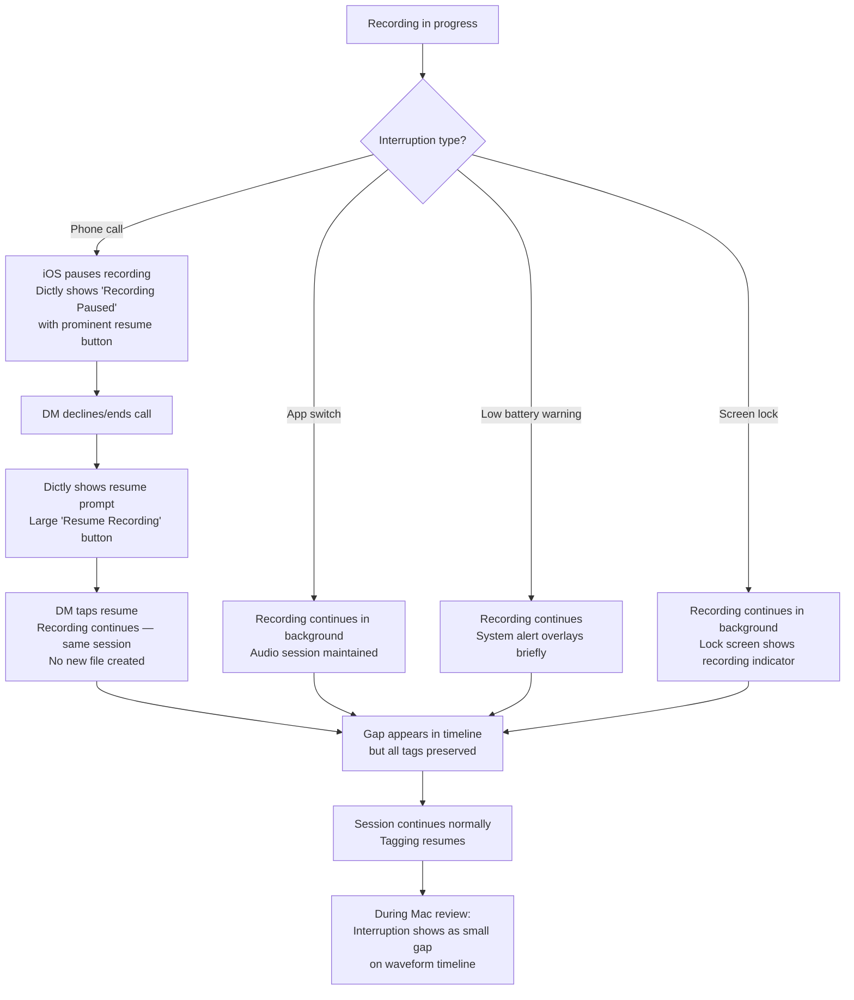

# UX Design Specification Dictly

**Author:** Stejk
**Date:** 2026-04-01

---

## Executive Summary

### Project Vision

Dictly is a paired iOS + macOS application that gives tabletop RPG Dungeon Masters a long-term campaign memory. During in-person sessions, the DM places their iPhone on the table, records audio, and taps a single button to tag important moments — NPC introductions, plot hooks, rulings, funny quotes, subtle hints. Each tag anchors to ~10 seconds before the tap, capturing the actual moment rather than the moment of recognition. After the session, the recording imports to a Mac companion app where tagged segments are transcribed locally via WhisperX, organized into a searchable session archive, and exported as markdown. No cloud processing, no subscriptions, no data leaving the user's devices.

The core UX thesis: the DM is the signal filter. One tap, under two seconds, no immersion break — the DM captures what matters with contextual judgment no AI can replicate. Reviewing a session takes minutes instead of hours, and tagged moments accumulate into a searchable campaign archive that grows more valuable with every session.

### Target Users

**Primary: The Dungeon Master / Game Master** — runs in-person sessions weekly or biweekly with 3–6 players. Already juggling narrative, rules, improv, and player management simultaneously. Tech-savvy (iPhone + Mac owner), familiar with session/campaign concepts, and deeply motivated to preserve session continuity. The pain is acute: lost NPC names, forgotten plot hooks, prep time wasted reconstructing what happened instead of planning what's next.

**Context of use:** Phone placed face-up on the table during 3–5+ hour sessions. Tagging happens mid-conversation, mid-ruling, mid-improv — the interaction must be invisible to the table. Post-session review happens on Mac the next day, typically in a focused 10–15 minute window. Pre-session prep uses the archive as primary reference, searching across sessions for continuity.

### Key Design Challenges

1. **Zero-friction tagging during live play** — The entire product thesis depends on tagging being so fast and natural it doesn't break DM immersion. Tag palette must be reachable, recognizable, and tappable in under 2 seconds with zero cognitive overhead. Any confirmation dialog, typing requirement, or visual attention demand is a failure.

2. **Two-app handoff** — The iPhone-to-Mac transfer must feel seamless, not like a chore. If post-session review has friction, DMs won't do it consistently, and the archive never compounds. AirDrop is the primary mechanism; the UX must handle import, deduplication, and organization without manual file management.

3. **Timeline navigation at scale** — A session with 30+ tags on a 4-hour waveform needs smart navigation. The Mac review interface must support rapid scrubbing, filtering, and jumping without feeling overwhelming. Cross-session search across 10+ sessions must surface relevant moments quickly.

4. **Onboarding without over-explaining** — The app targets DMs who already understand sessions and campaigns. Defaults must be immediately sensible (D&D-oriented presets), setup should take under 2 minutes, and the first recording experience should feel obvious.

### Design Opportunities

1. **Haptic-first interaction** — Haptic feedback on tag placement confirms the action without visual attention. This becomes a signature interaction that reinforces the "stay present at the table" brand promise. The DM feels the tag register through touch alone.

2. **Compounding archive value** — The search and browse experience across 10+ sessions is where Dictly becomes irreplaceable. Designing cross-session discovery well — surfacing connections, showing tag density, enabling filtered browsing by category — creates the retention moat that makes the product harder to leave with every session.

3. **Waveform as primary navigation** — The timeline with color-coded tag markers can make session review feel almost enjoyable. Visual density shows where the action was at a glance, and clicking any tag jumps directly to that moment. The waveform becomes the spatial anchor for the entire review experience.

## Core User Experience

### Defining Experience

Dictly operates across three distinct experience modes spanning two platforms:

| Mode | Platform | Core Action | Context |
|------|----------|-------------|---------|
| **Capture** | iOS | Tap to tag while recording | Mid-session, phone on table, attention elsewhere |
| **Review** | macOS | Scrub, listen, annotate, transcribe | Post-session, focused desk time, 10–15 min |
| **Recall** | macOS | Search and browse the archive | Pre-session prep, quick lookups |

The **one-tap tag during live play** is the defining interaction. Everything flows from this: if tagging feels natural and invisible, the archive fills up, review is fast, prep is transformed. If tagging feels like a chore, nothing else matters. This single interaction carries the entire product thesis.

### Platform Strategy

- **iOS (SwiftUI):** Touch-first, large tap targets, haptic feedback as primary confirmation, background recording resilience, minimal visual attention required. The phone sits face-up on the table — the UI must be glanceable and operable with a quick reach.
- **macOS (SwiftUI):** Mouse/keyboard, information-dense layouts, waveform-centric navigation, productivity-oriented workflows. This is where the DM sits down with focus and works through their session data.
- **Fully offline:** No accounts, no cloud dependency. AirDrop bridges the two platforms. The Mac app registers as a handler for Dictly session bundles.
- **No feature overlap:** iOS captures, Mac reviews. Each app does its job without trying to do the other's.

### Effortless Interactions

1. **Tagging** — Single tap, haptic confirmation, no typing, no confirmation dialog, no need to look at the phone. The DM's eyes stay on the table.
2. **Starting a session** — Open app, pick campaign (or continue the last one), hit record. Under 5 seconds from app launch to recording.
3. **Import to Mac** — AirDrop the session, Mac recognizes the bundle, session appears organized under the correct campaign automatically. No manual file management.
4. **Finding a moment from 5 sessions ago** — Search "Grimthor", get results across sessions, click, hear the audio. The archive rewards long-term use.

### Critical Success Moments

1. **First tag during first session** — The DM tags something, feels the haptic, realizes they didn't break flow. This is the "aha" moment that validates the product's reason to exist.
2. **First post-session review** — The DM sees 25 color-coded tags on a timeline and reviews the entire session in 12 minutes. The reaction: "This actually works."
3. **First cross-session search** — The DM searches an NPC name and surfaces moments from 3 different sessions. The archive has become irreplaceable.
4. **Recording survival** — A 4-hour session ends. The phone had calls and screen locks throughout. Zero audio lost. Trust is established — the DM stops worrying and starts relying.

### Experience Principles

1. **Table presence first** — Every iOS design decision serves one rule: never break immersion. Large targets, zero typing, haptic over visual, under 2 seconds. If it pulls the DM out of the game, it's wrong.
2. **Capture is fast, review is rich** — iOS is deliberately minimal; Mac is deliberately information-dense. The capture app is a scalpel; the review app is a workbench. Don't mix these up.
3. **The archive earns its value** — Every session makes the product more valuable. Design search, browse, and cross-session features to reward long-term use. After 10 sessions it's useful; after 50 it's irreplaceable.
4. **Trust through reliability** — Recording never fails, tags never vanish, transfer never corrupts. The DM must trust the tool absolutely to use it unconsciously. One lost session destroys that trust permanently.

## Desired Emotional Response

### Primary Emotional Goals

1. **Calm confidence during capture** — The DM should feel like they have a safety net. "I don't need to stress about remembering this — I tagged it." The product reduces cognitive load, not adds to it. The feeling is *relief*, not productivity pressure.

2. **Satisfying control during review** — Post-session, the DM should feel like a curator — scrubbing through their session, refining tags, reading transcriptions. The emotion is quiet mastery: "I have a complete record of what happened, and I built it myself."

3. **Genuine surprise during recall** — When searching the archive and surfacing a forgotten moment from 5 sessions ago, the DM should feel a spark of rediscovery — the product delivered something they couldn't have retrieved from memory alone.

### Emotional Journey Mapping

| Moment | Desired Feeling | Design Lever |
|--------|----------------|--------------|
| First launch | "This is simple, I get it" | Sensible defaults, under-2-minute setup, no tutorial walls |
| First tag during play | "That was nothing — I barely broke stride" | Haptic confirmation, large target, no follow-up required |
| Glancing at tag count mid-session | "Good, I'm building something" | Subtle counter, reassuring accumulation |
| End of session | "I captured everything that mattered" | Tag summary list, session complete confirmation |
| AirDrop import to Mac | "That just worked" | Automatic recognition, no file management |
| Timeline review on Mac | "I can see the whole session at a glance" | Color-coded density on waveform, filterable sidebar |
| Cross-session search | "I would have forgotten this without Dictly" | Fast results, direct audio playback, context shown |
| Recording interruption | "It handled it — nothing lost" | Clear pause/resume state, seamless continuity |

### Micro-Emotions

- **Confidence over confusion** — The DM must never wonder "did that tag register?" or "is it still recording?" Haptic feedback and persistent visual indicators eliminate ambiguity.
- **Trust over skepticism** — Zero data loss across sessions builds deep trust. One lost recording destroys it.
- **Accomplishment over frustration** — Post-session review should feel like wrapping a gift, not doing homework. 12 minutes, done.

**Emotions to Avoid:**
- **Guilt** — "I should have tagged more" — the product should never make the DM feel they're using it wrong
- **Performance anxiety** — tagging is not a test; missing a moment is fine because retroactive tagging exists
- **Tech friction frustration** — any moment where the DM thinks about the *tool* instead of the *game* is a failure

### Design Implications

| Emotion | UX Design Approach |
|---------|-------------------|
| Calm confidence | Haptic-first feedback, persistent recording indicator, no confirmation dialogs |
| Satisfying control | Rich timeline view, editable tags, retroactive tagging, manual transcription correction |
| Surprise/delight | Cross-session search surfacing forgotten moments, archive growing visibly richer |
| Trust | Frequent audio flush to disk, zero-loss architecture, clear pause/resume states |
| Low pressure | No usage metrics, no "you tagged less than usual" nudges, retroactive tagging as safety net |

### Emotional Design Principles

1. **Reduce cognitive load, never add it** — Every interaction should leave the DM with less to worry about, not more. The product absorbs anxiety about forgetting.
2. **Confirm without demanding attention** — Haptics, subtle animations, and persistent indicators replace dialogs and alerts. The DM's attention belongs to the table.
3. **Reward accumulation, don't punish gaps** — The archive should feel like it's growing richer, never like it has holes. Retroactive tagging and full audio access mean nothing is truly lost.
4. **Make review feel like a gift to your future self** — Post-session review should feel brief, satisfying, and forward-looking — "future me will thank me for this."

## UX Pattern Analysis & Inspiration

### Inspiring Products Analysis

**D&D Beyond**
- **What they nail:** Information density without overwhelm. Character sheets pack enormous amounts of data into a navigable, scannable layout. Tabs, collapsible sections, and contextual tooltips let users drill into detail without losing the big picture. The mobile app is optimized for at-the-table use — quick lookups mid-session, large touch targets for spell slots and HP tracking.
- **Emotional tone:** Competent, organized, game-aware. It speaks the user's language (D&D terminology everywhere, no over-explanation). The UI trusts that users know what they're looking at.
- **Key lesson for Dictly:** The Mac review app has a similar information density challenge — tags, waveform, transcriptions, notes, filters. D&D Beyond shows how to present rich data without feeling like a spreadsheet. The iOS app's at-the-table optimization is directly relevant to Dictly's recording screen.

**Headspace**
- **What they nail:** Calm, focused onboarding that doesn't overwhelm. Progressive disclosure — you see only what you need right now. The session experience is beautifully minimal: a timer, gentle animations, and nothing else competing for attention. The session history creates a satisfying sense of accumulation without pressure.
- **Emotional tone:** Warm, low-pressure, encouraging. Never punishes missed days — just welcomes you back. Animations and micro-interactions feel rewarding without being distracting.
- **Key lesson for Dictly:** The recording screen on iOS should channel Headspace's session simplicity — minimal UI, confidence that the process is working, gentle feedback. The "archive grows richer over time" feeling maps to Headspace's history model, but without the guilt dimension.

**Voice Memos (Apple)**
- **What they nail:** Zero-friction recording start. One tap to record, waveform shows it's working, stop when done. The simplicity is the feature.
- **What they miss:** No structure, no tagging, no organization at scale. After 20 recordings, it's a mess. This is exactly where Dictly adds value.
- **Key lesson for Dictly:** Match Voice Memos' recording start speed (under 2 seconds), then surpass it with structured tagging that Voice Memos can't offer.

**Ferrite Recording Studio**
- **What they nail:** Professional waveform editing on iPad. Timeline scrubbing feels precise and responsive. Multi-track visualization is clear. Bookmark markers on the waveform are the closest existing pattern to Dictly's tag markers.
- **Key lesson for Dictly:** The Mac timeline/waveform view should aim for Ferrite's level of scrubbing responsiveness and visual clarity, adapted for tag-centric (not edit-centric) workflows.

### Transferable UX Patterns

**Navigation Patterns:**
- **D&D Beyond's tabbed information panels** — Apply to the Mac session player: tag sidebar, detail panel, and waveform as parallel information zones that don't compete. Each zone serves a distinct purpose.
- **Headspace's progressive disclosure** — Apply to iOS onboarding: show campaign creation first, reveal tag customization only when relevant, never front-load complexity.

**Interaction Patterns:**
- **Headspace's minimal session screen** — The iOS recording screen should be similarly focused: recording indicator, tag palette, and nothing else. No settings, no navigation, no distractions.
- **Voice Memos' one-tap start** — Recording must start in one tap. Campaign/session selection can use smart defaults (last campaign, auto-numbered session) to eliminate pre-recording friction.
- **D&D Beyond's contextual tooltips** — On Mac, hovering over a tag marker on the waveform could show a preview (label, category, transcription snippet) without requiring a click.

**Visual Patterns:**
- **Headspace's warm, calm color palette** — Dictly's iOS recording screen should feel calm and unobtrusive, not clinical or utilitarian. Muted tones, gentle contrast.
- **D&D Beyond's category color-coding** — Tag categories with distinct, recognizable colors on the waveform timeline. D&D players are comfortable with color-coded information systems.
- **Ferrite's waveform rendering** — Clean, responsive waveform with overlay markers. The waveform is the spatial anchor; markers are the access points.

### Anti-Patterns to Avoid

1. **Otter.ai's "wall of transcription"** — Showing a full session transcription with no structure is overwhelming and useless. Dictly transcribes only tagged segments, which is already better, but the UI must present transcriptions attached to their tags, not as a continuous text dump.
2. **Voice Memos' flat list at scale** — No hierarchy, no search, no filtering. After 20 sessions, finding anything is painful. Dictly must have campaign/session structure from day one.
3. **Excessive onboarding flows** — While progressive disclosure is great, multi-screen onboarding before first use is too long for a utility tool. DMs want to record now. Setup should be under 2 minutes with zero required tutorials.
4. **Complex audio editor UIs** — Ferrite and similar apps expose track mixing, effects, and editing tools. Dictly is not an audio editor. The waveform is for navigation and tag placement only — resist feature creep toward editing.

### Design Inspiration Strategy

**Adopt:**
- Headspace's minimal session screen philosophy for iOS recording
- D&D Beyond's information-dense-but-navigable panel layout for Mac review
- Voice Memos' one-tap recording start speed
- D&D Beyond's assumption that users speak the domain language (no over-explaining D&D concepts)

**Adapt:**
- Headspace's accumulation model — adapt as "growing archive" without the daily-habit pressure framing
- Ferrite's waveform + markers — adapt from an editing tool to a tag-navigation tool (simpler, less precise, more contextual)
- D&D Beyond's color-coding system — adapt for tag categories with both color and icon/label for accessibility

**Avoid:**
- Otter.ai's unstructured transcription dumps
- Voice Memos' lack of organization at scale
- Audio editor complexity creep
- Overly long onboarding flows for a utility tool

## Design System Foundation

### Design System Choice

**HIG-First with Selective Custom Components** — Use Apple's Human Interface Guidelines and native SwiftUI components as the default foundation, with custom-built components only where Dictly's unique UX demands it.

This is a native Apple ecosystem product (iOS + macOS, both SwiftUI). Web-oriented design systems (Material, Ant, Chakra) do not apply. The decision is between fully native, fully custom, or a targeted hybrid.

### Rationale for Selection

- A solo Swift developer ships fastest by leveraging Apple's native patterns for the 80% of the app that's standard (campaign lists, settings, navigation, session history)
- The 20% that makes Dictly special — the tag palette, waveform timeline, recording screen — gets custom attention where it matters most
- Native components provide Dark Mode, Dynamic Type, VoiceOver, and platform conventions for free
- Dictly's brand identity lives in the custom components (tag palette colors, waveform visualization, recording screen aesthetic), not in reinventing navigation bars
- Both Headspace and D&D Beyond follow this pattern: native platform conventions for structure, custom design for the core experience

### Implementation Approach

**Native SwiftUI components for:**
- NavigationStack, Lists, Forms, Tab views
- Settings screens
- Sheets and modals
- Standard navigation patterns

**Custom SwiftUI components for:**
- **Tag palette** — large tap targets, category tabs, haptic integration, one-tap interaction
- **Waveform timeline** — Core Audio rendering, color-coded tag markers, scrubbing, zoom
- **Recording screen** — minimal UI, recording indicator, tag counter, calm aesthetic
- **Session transfer UI** — AirDrop integration, import progress, session recognition

**Shared design tokens** defined as a Swift package used by both iOS and Mac targets:
- Color palette (tag category colors, brand accents, semantic colors)
- Typography scale
- Spacing system
- Animation curves and timing

### Customization Strategy

- Define a `DictlyTheme` Swift package with shared colors, fonts, and spacing constants across both targets
- **Tag category colors** are the primary visual signature — 5 distinct, accessible colors (Story, Combat, Roleplay, World, Meta) that carry consistently from the iOS tag palette to the Mac waveform markers
- Warm, calm base palette inspired by Headspace's tone — the app should feel inviting and low-pressure, not clinical or utilitarian
- Custom components follow HIG interaction patterns (swipe gestures, context menus, drag-and-drop) even when visually custom — users should never feel lost in platform conventions
- All custom components must support Dynamic Type, Dark Mode, and VoiceOver as baseline requirements

## 2. Core User Experience

### 2.1 Defining Experience

**"Tap to tag a moment — it captures what just happened."**

The rewind-anchor tag is Dictly's defining interaction. The DM hears something important, taps once, and the app captures the 10 seconds *before* the tap. This is the interaction the DM will describe to other DMs: "I just tap when something cool happens, and it saves it."

The rewind-anchor inverts the standard bookmark model. Normal bookmarks mark "now." Dictly marks "just before now" — matching how human attention actually works. You realize something was important a few seconds after it happened. The tap captures the moment, not the reaction.

### 2.2 User Mental Model

**How DMs currently solve this:**
- Scribbled notes mid-session (breaks immersion, incomplete)
- Full recording in Voice Memos (never re-listened)
- Memory alone (details fade within days)
- Post-session notes from memory (30+ minutes, missing nuance)

**Mental model they bring:** DMs understand bookmarking — they already mentally note "that was important" during play. Dictly externalizes that mental bookmark into a physical tap. The mental model is: "I'm placing a pin in the timeline."

**Where confusion could arise:**
- The rewind concept — "wait, it captured *before* I tapped?" This is initially surprising but immediately intuitive once experienced. The first tag is the teaching moment.
- Category selection — DMs might worry about picking the "right" category mid-session. The design must communicate: any tag is better than no tag, categories are refinable later.

### 2.3 Success Criteria

| Criterion | Target | Why It Matters |
|-----------|--------|---------------|
| Tag placement time | < 2 seconds from intent to tap | Longer breaks immersion |
| Haptic confirmation | Immediate (< 200ms) | DM needs to know it registered without looking |
| Visual attention required | Zero — glanceable at most | Eyes belong on the table |
| Tags per session | 15–40 feels natural | Too few = not useful; too many = anxiety |
| Category selection | Optional, defaults available | Reduces decision friction to zero |
| Error recovery | No "wrong" tags — all editable later | Eliminates performance anxiety |

### 2.4 Novel UX Patterns

**The Rewind-Anchor Tag (Novel)**

This is a genuinely new interaction pattern. No existing app combines one-tap placement, automatic rewind to capture the preceding moment, category-based organization, and haptic-only confirmation.

**How to teach it:** Don't. The first tag teaches itself. The DM taps, feels the haptic, and later during review sees that the captured audio starts before their tap. The "oh, it got the actual moment" realization is the aha. No tutorial needed — the product demonstrates its own magic.

**Familiar metaphors leveraged:**
- **Bookmark/pin** — users understand placing markers on a timeline
- **Voice Memos' record button** — the recording interaction is completely standard
- **Photo burst / Live Photo** — Apple users already know the concept of capturing moments around a trigger

**Established Patterns Used:**
- Standard iOS recording (AVAudioSession, background audio)
- Standard AirDrop sharing
- Standard waveform timeline (adapted from audio editors)
- Standard list/detail navigation (campaigns > sessions > tags)

### 2.5 Experience Mechanics

**1. Initiation — Starting a Recording**
- DM opens Dictly, sees their campaign (or creates one in under 1 minute)
- Taps "New Session" — large, prominent button
- Recording starts immediately with haptic pulse and visual indicator
- Phone goes face-up on the table

**2. Core Interaction — Tagging a Moment**
- Something important happens at the table
- DM glances at phone (under 1 second), taps a tag button from the palette
- **Fastest path:** Tap the most recently used tag category's default tag — one tap, done
- **Categorized path:** Tap a category tab, then tap a specific tag — two taps, still under 2 seconds
- **Custom path:** Tap "+", type a short label, dismiss — 5–10 seconds, used sparingly
- Haptic pulse confirms. Tag count increments. DM's attention returns to the table.
- The tag anchors to ~10 seconds before the tap (configurable: 5/10/15/20s)

**3. Feedback — Knowing It Worked**
- **Haptic:** Medium impact feedback generator fires immediately on tap
- **Visual:** Brief highlight animation on the tapped tag button, tag count increments
- **Auditory:** None — the table is loud and sounds would be disruptive
- **Error state:** There is no wrong tag. Any tag can be renamed, recategorized, or deleted during review. The system communicates "you can't mess this up."

**4. Completion — Ending the Session**
- DM taps "Stop Recording" — requires confirmation (this is the one destructive action worth confirming)
- Session summary appears: duration, tag count, tag list with categories
- "Transfer to Mac" prompt with AirDrop button
- Session is safely stored on device even if transfer is deferred

## Visual Design Foundation

### Color System

**Brand Personality:** Warm, calm, trustworthy, game-aware. The app should feel like a well-crafted tool that belongs at a tabletop — not clinical, not playful to the point of distraction.

**Base Palette (Light Mode):**

| Role | Color | Hex | Usage |
|------|-------|-----|-------|
| Background | Warm off-white | `#FAF8F5` | Primary canvas |
| Surface | Soft cream | `#F2EDE7` | Cards, panels, elevated surfaces |
| Text Primary | Deep charcoal | `#1C1917` | Headings, primary content |
| Text Secondary | Warm gray | `#78716C` | Captions, metadata, timestamps |
| Border | Warm light gray | `#E7E0D8` | Dividers, card edges |

**Base Palette (Dark Mode):**

| Role | Color | Hex | Usage |
|------|-------|-----|-------|
| Background | Deep warm black | `#1A1816` | Primary canvas |
| Surface | Dark warm gray | `#292524` | Cards, panels |
| Text Primary | Warm white | `#F5F0EB` | Headings, primary content |
| Text Secondary | Muted warm gray | `#A8A29E` | Captions, metadata |
| Border | Warm dark gray | `#3D3835` | Dividers, card edges |

Dark Mode is likely the default during sessions (dim rooms, less screen glare on the table). The dark palette must feel warm, not cold-blue like stock dark mode.

**Tag Category Colors — The Visual Signature:**

These are the most important colors in the product. They carry from the iOS tag palette through the Mac waveform timeline. Each must be distinct at a glance, readable on both light and dark backgrounds, and accessible (WCAG AA contrast).

| Category | Color | Hex | Character |
|----------|-------|-----|-----------|
| **Story** | Warm amber | `#D97706` | Gold/treasure — narrative arcs, plot hooks |
| **Combat** | Muted crimson | `#DC2626` | Blood/action — encounters, epic rolls |
| **Roleplay** | Soft violet | `#7C3AED` | Magic/expression — character moments, quotes |
| **World** | Forest green | `#059669` | Nature/terrain — locations, lore, items |
| **Meta** | Slate blue | `#4B7BE5` | Cool/neutral — rulings, schedule, out-of-game |

**Accent & State Colors:**

| Role | Color | Hex | Usage |
|------|-------|-----|-------|
| Recording active | Soft red pulse | `#EF4444` | Recording indicator, animated glow |
| Success | Green | `#16A34A` | Transfer complete, tag saved |
| Warning | Amber | `#F59E0B` | Low storage, battery, interruption |
| Destructive | Red | `#DC2626` | Delete confirmation |

### Typography System

Apple's system fonts (SF Pro on iOS/Mac) — optimized for both platforms, support Dynamic Type automatically, and feel native. No custom fonts for MVP. Brand personality comes from weight, size, and spacing choices, not typeface.

**Type Scale:**

| Level | Size (iOS) | Size (Mac) | Weight | Usage |
|-------|-----------|-----------|--------|-------|
| Display | 34pt | 28pt | Bold | Campaign name on home |
| H1 | 28pt | 24pt | Bold | Session title, screen headers |
| H2 | 22pt | 20pt | Semibold | Section headers |
| H3 | 17pt | 16pt | Semibold | Tag category labels, sidebar headers |
| Body | 17pt | 14pt | Regular | Transcriptions, notes, descriptions |
| Caption | 13pt | 12pt | Regular | Timestamps, metadata, tag counts |
| Tag Label | 15pt | 13pt | Medium | Tag text on palette and timeline markers |

**Typographic Principles:**
- iOS sizes are larger — designed for glanceable reading at arm's length (phone on table)
- Mac sizes are denser — designed for focused reading at desk distance
- Monospaced digits for timers and timestamps (SF Mono) for alignment
- All sizes honor Dynamic Type — no hardcoded point values in implementation

### Spacing & Layout Foundation

**Base Unit:** 8pt grid (standard Apple convention). All spacing derives from multiples of 8.

| Token | Value | Usage |
|-------|-------|-------|
| `space-xs` | 4pt | Tight spacing within components (icon-to-label) |
| `space-sm` | 8pt | Compact internal padding |
| `space-md` | 16pt | Standard padding, gaps between related items |
| `space-lg` | 24pt | Section separation, card padding |
| `space-xl` | 32pt | Major section gaps |
| `space-2xl` | 48pt | Screen-level breathing room |

**iOS Layout Principles:**
- Tag palette buttons: minimum 48x48pt tap target (Apple HIG minimum 44pt, larger for mid-game tapping)
- Recording screen: generous spacing, large elements — used at arm's length with peripheral attention
- Campaign/session lists: standard iOS list density using native `List` component spacing

**Mac Layout Principles:**
- Three-panel layout for session review: tag sidebar (240pt fixed) | waveform timeline (flexible, primary) | detail/notes panel (280pt, collapsible)
- Information-dense but not cramped — D&D Beyond density, not spreadsheet density
- Waveform timeline: full-width, minimum 120pt height, with tag markers as colored pins overlaid

**Animation & Motion:**
- Tag placement: brief scale pulse (0.95 to 1.0, 150ms ease-out) on the tag button
- Recording indicator: gentle breathing glow on the red dot (2s cycle)
- Waveform scrubbing: 60fps smooth scrolling
- Screen transitions: standard SwiftUI navigation transitions

### Accessibility Considerations

- **Contrast ratios:** All tag category colors meet WCAG AA (4.5:1) against both light and dark surfaces. Tag markers on the waveform use both color and shape (different marker shapes per category) for color-blind users.
- **Dynamic Type:** All text scales with system font size preferences. Tag palette adapts layout at larger sizes (fewer columns, larger buttons).
- **VoiceOver:** All custom components (tag palette, waveform, recording controls) provide meaningful accessibility labels. Tags announce: "[Category]: [Label] at [timestamp]".
- **Reduced Motion:** Respect `UIAccessibility.isReduceMotionEnabled` — replace animations with instant state changes.
- **Dark Mode:** Full support with warm-toned dark palette. Recording screen auto-suggests dark mode during sessions (less table glare).

## Design Direction Decision

### Design Directions Explored

Six design directions were explored via interactive HTML mockups (`ux-design-directions.html`) — four iOS recording screen variations and two Mac review screen layouts:

**iOS Directions:**
- A: Minimal Zen — Headspace-inspired, timer + breathing dot + flat tag palette
- B: Card Grid — D&D Beyond-inspired, category tabs + 2-column card grid
- C: Bottom Sheet — iOS-native, waveform top + draggable tag sheet
- D: Floating Action — session context + FAB opens tag picker

**Mac Directions:**
- E: Three-Panel Classic — sidebar + waveform + detail right panel
- F: Waveform-Dominant — large waveform hero + two-panel below

Each was evaluated against the experience principles: table presence first, capture is fast / review is rich, trust through reliability.

### Chosen Direction

**iOS — Hybrid Card Grid + Waveform + Timestamp-First Interaction (Directions B + D):**

Layout (top to bottom):
1. Header: recording indicator (animated red dot + "REC"), session timer in large tabular-nums font, tag count badge
2. Compact live waveform (~48pt height) — visual heartbeat confirming recording is active, not for navigation
3. Category tabs with color dots — segmented control filtering tags by category
4. 2-column tag card grid with color-coded left stripe — large tap targets (minimum 48pt height)
5. Dashed "+" custom tag card + "Stop Recording" bar

Timestamp-first interaction model (key innovation from Direction D):
- **Standard tag (1 tap):** DM taps a tag card. Timestamp + rewind-anchor captured instantly. Haptic fires. Done in under 2 seconds.
- **Custom tag (2 taps):** DM taps "+". Timestamp + rewind-anchor captured immediately on this first tap — the moment is already saved. Then a quick category picker + short text input appears. The DM can take their time — the moment is already anchored. The label is saved with the original timestamp, not when typing finished.
- This separates the time-critical action (capturing the moment) from the non-critical action (categorizing it). No moment is ever lost waiting for the DM to type.

**Mac — Modified Three-Panel (Direction E) with Detail Below Waveform:**

Layout:
1. Left sidebar (260pt): search input + category filter pills + scrollable tag list with color dots
2. Main area — toolbar: session name, campaign/duration/tag count metadata, Transcribe All / Export MD / Session Notes actions
3. Main area — waveform timeline: full remaining width, color-coded tag markers with circle heads, playhead indicator, playback controls
4. Main area — detail below waveform (contextual): appears when a tag is selected

Detail area when tag selected (two-column):
- Left column: tag name (editable) + category badge + timestamp, WhisperX transcription (editable inline), free-form notes area, action buttons (Edit Label, Change Category, Delete Tag)
- Right column: cross-session related tags ("Other mentions of Grimthor" across all sessions), session-level summary notes

When no tag is selected, the detail area shows a placeholder prompt.

### Design Rationale

1. **iOS B+D hybrid over A or C:** The card grid provides organized, scalable tag access with clear category structure that D&D Beyond users expect. The waveform adds visual recording confirmation (addressing "is it still recording?" micro-emotion). The timestamp-first interaction from Direction D is the key insight — it decouples time-critical capture from non-critical categorization.

2. **Mac E (modified) over F:** The three-panel layout is more familiar to Mac users (Mail, Xcode, Finder) and keeps the tag sidebar always visible for quick scanning. Moving the detail area below the waveform (instead of a right panel) gives the waveform more horizontal space while creating a natural top-to-bottom review flow: see the tag on the waveform, hear it, read the transcription, annotate it.

3. **Cross-session related tags in detail panel:** When reviewing a tag, automatically surfacing other mentions of the same NPC/location/concept across sessions creates the "archive earns its value" experience. This is where the compounding retention moat becomes visible to the user.

### Implementation Approach

**iOS Recording Screen:**
- SwiftUI with category tabs as a horizontally scrollable `Picker` or segmented control
- Tag grid as `LazyVGrid` with 2 flexible columns
- Waveform as a custom SwiftUI view sampling `AVAudioEngine` levels
- Timestamp-first: on any tag tap, immediately create the tag record with rewind-anchor timestamp; custom flow presents a `.sheet` for label input after creation
- Haptic via `UIImpactFeedbackGenerator(.medium)` on every tag placement

**Mac Session Review:**
- `NavigationSplitView` with sidebar for tag list
- Custom waveform view (Core Audio / `AVAudioFile` rendering) with overlay tag markers
- Detail area as a conditional view below the waveform, animated in on tag selection
- Related tags populated by full-text search across session transcriptions and tag labels
- All text fields (transcription, notes, tag label) are inline-editable with standard macOS text editing

## User Journey Flows

### Journey 1: First Session — Onboarding to First Tag



**Key design decisions:**
- Onboarding is 2 screens maximum: campaign name + tag review. Under 2 minutes.
- Default tags are pre-loaded and good enough to use immediately — no forced customization.
- First tag teaches the rewind concept by demonstration, not tutorial.
- Stop Recording is the only action requiring confirmation (destructive).

### Journey 2: Pre-Session Prep — Archive Search



**Key design decisions:**
- Search is the primary entry point for prep — returns results across all sessions.
- Results include transcription snippets so the DM can scan without opening each tag.
- Related tags panel surfaces cross-session connections automatically.

### Journey 3: Post-Session Review — Import to Annotation



**Key design decisions:**
- AirDrop import is zero-friction — Mac auto-recognizes Dictly bundles.
- Deduplication handles re-imports gracefully.
- Top-to-bottom review flow: sidebar → waveform → transcription → notes.
- Retroactive tagging covers gaps — scrub the waveform, place a new tag.
- Batch transcription runs after review so edits to tag labels happen first.

### Journey 4: Recording Interruption Recovery



**Key design decisions:**
- Phone calls are the primary interruption risk — clear pause/resume UI.
- Screen lock, app switch, and battery warnings don't interrupt recording.
- Resume is a single prominent button — no navigation needed.
- Zero data loss is the non-negotiable outcome.

### Journey Patterns

**Navigation Patterns:**
- **Campaign → Session → Tag** hierarchy is consistent across both apps. Never more than 3 levels deep.
- **Sidebar as persistent navigation** on Mac — tag list always visible, never hidden behind a toggle.
- **Back-to-top flow on Mac** — search results or cross-session browsing always returns to the tag-in-context view.

**Interaction Patterns:**
- **Timestamp-first on every tag action** — whether standard or custom, the anchor is captured on first touch.
- **Inline editing everywhere on Mac** — tag labels, transcriptions, notes are all editable in place. No separate edit screens.
- **Confirmation only for destructive actions** — Stop Recording and Delete Tag. Everything else is instant.

**Feedback Patterns:**
- **Haptic on iOS for every tag** — medium impact, immediate.
- **Visual count increment** — tag count updates on every placement, provides accumulation satisfaction.
- **Waveform as persistent confidence signal** — on iOS (recording is alive), on Mac (session overview at a glance).

### Flow Optimization Principles

1. **Minimize steps to first tag:** App launch → campaign (remembered) → New Session → Record → Tag. Five taps from cold launch, three from warm launch.
2. **Make review a linear scan:** Tags presented chronologically in the sidebar. The DM works top to bottom, clicking each, annotating if needed. No mode switches.
3. **Let search do the heavy lifting for prep:** Pre-session prep is search-first. The DM types a name or term, gets results across sessions, clicks to context. Three steps to any moment in the archive.
4. **Handle all interruptions silently except phone calls:** Only phone calls require user action to resume. Everything else continues recording without intervention.

## Component Strategy

### Design System Components

Native SwiftUI components used without customization:

| Component | SwiftUI | Used In |
|-----------|---------|---------|
| Navigation structure | `NavigationStack`, `NavigationSplitView` | Campaign → Session → Tag hierarchy |
| Lists | `List`, `LazyVStack` | Campaign list, session list, tag sidebar |
| Forms & settings | `Form`, `Toggle`, `Picker` | Settings, campaign creation, tag management |
| Buttons | `Button` | Stop recording, toolbar actions, export |
| Sheets & modals | `.sheet`, `.confirmationDialog` | Stop confirmation, custom tag input |
| Search | `.searchable` | Mac search across sessions |
| Context menus | `.contextMenu` | Tag right-click actions on Mac |
| Segmented control | `Picker(.segmented)` | Category filter tabs |
| Text editing | `TextEditor`, `TextField` | Notes, transcription editing, tag labels |
| Toolbars | `.toolbar` | Mac session toolbar |

### Custom Components

**1. TagCard (iOS)**

The primary interaction surface of the entire product — tappable tag button in the recording screen grid.

- **Anatomy:** Color stripe (left edge, 4pt, category color) + tag label (14pt medium) + category name (11pt caption)
- **States:** Default (surface background, muted) → Pressed (scale 0.96, category color glow, haptic fires)
- **Variants:** Standard tag card (pre-defined), Custom tag card (dashed border, "+" icon)
- **Accessibility:** Label reads "[Tag name], [Category]. Double-tap to place tag." Minimum 48x48pt tap target.

**2. LiveWaveform (iOS)**

Compact real-time waveform visualization confirming recording is active. Confidence signal, not navigation tool.

- **Anatomy:** Horizontal bar chart sampling audio levels, "LIVE" label (right-aligned, subtle), rounded surface container
- **States:** Recording active (bars animate real-time, recent bars in recording-red) → Paused (bars freeze, color shifts to muted gray, "PAUSED" label)
- **Behavior:** Samples `AVAudioEngine` audio levels at ~15fps. Scrolls left as new samples arrive. Height: 48pt.
- **Accessibility:** VoiceOver reads "Live audio waveform. Recording is active." or "Recording is paused."

**3. CategoryTabBar (iOS)**

Horizontally scrollable category filter for the tag grid with color-coded dots.

- **Anatomy:** Row of pill-shaped tabs inside rounded surface container. Each tab: colored dot (6pt) + category name. Active tab: darker background, white text.
- **States:** Default (muted text) → Active (elevated background, full-color text). Scrollable with fade edges if many categories.
- **Accessibility:** Each tab reads "[Category name] filter. [X] tags available."

**4. SessionWaveformTimeline (Mac)**

The primary navigation surface for session review — full-width waveform with overlaid color-coded tag markers and playhead.

- **Anatomy:** Waveform bars from audio file data (Core Audio / `AVAudioFile`). Tag markers: colored circles at top with vertical line extending down. Playhead: vertical white line with diamond cap, draggable. Selected tag: ring highlight / glow.
- **States:** Default (markers 75% opacity) → Tag hovered (tooltip: label + timestamp) → Tag selected (full opacity, ring highlight, playhead jumps) → Scrubbing (playhead follows drag, audio scrub preview)
- **Behavior:** 60fps during scrub. Click anywhere to reposition playhead. Click marker to select tag. Zoom support (pinch/scroll) for dense sessions.
- **Accessibility:** Each marker is focusable. Arrow keys navigate between markers. VoiceOver: "[Category]: [Label] at [timestamp]."

**5. TagDetailPanel (Mac)**

Contextual editing area below the waveform — appears when a tag is selected.

- **Anatomy:** Header (editable tag label + category badge + timestamp), transcription block (WhisperX output, editable inline), notes area (free-form editable text), action row (Edit Label, Change Category, Delete Tag), related tags column (cross-session search results)
- **States:** Empty (no tag selected, centered placeholder) → Populated (full layout) → Editing (text fields gain border on focus, save on blur)
- **Behavior:** Appears with animation on tag selection. Transcription and notes auto-save on blur. Related tags populate from full-text search across all session transcriptions.

**6. RecordingStatusBar (iOS)**

Persistent header during recording showing state, elapsed time, and tag count.

- **Anatomy:** Animated red dot + "REC" label, large tabular-nums timer, tag count pill badge
- **States:** Recording (dot pulses, timer increments) → Paused (dot stops, "PAUSED" label, timer freezes) → Resuming (transition animation)
- **Accessibility:** VoiceOver reads "Recording. [Duration]. [Count] tags placed." Updates every 30 seconds.

**7. TransferPrompt (iOS)**

Post-session prompt for AirDrop transfer to Mac.

- **Anatomy:** Session summary card (duration, tag count, category breakdown), AirDrop button (prominent), "Transfer Later" secondary option
- **States:** Ready → Transferring (progress) → Complete (checkmark) → Failed (retry with error context)

### Component Implementation Strategy

**Shared Swift Package (`DictlyUI`):**
- `DictlyTheme`: colors, typography, spacing tokens
- `TagCard`: reusable across iOS recording screen
- `CategoryTabBar`: used on iOS recording, potentially Mac filters
- Data models for Tag, Session, Campaign shared between targets

**iOS-only components:** `LiveWaveform`, `RecordingStatusBar`, `TransferPrompt` — use iOS-specific APIs (`AVAudioEngine`, `UIImpactFeedbackGenerator`, AirDrop)

**Mac-only components:** `SessionWaveformTimeline`, `TagDetailPanel` — use Mac-specific APIs (Core Audio rendering, `NSTextView` for rich editing)

### Implementation Roadmap

**Phase 1 — Core (Recording + Review):**
- TagCard + CategoryTabBar + RecordingStatusBar (iOS recording screen)
- LiveWaveform (iOS confidence signal)
- SessionWaveformTimeline (Mac primary navigation)
- TagDetailPanel (Mac review workflow)

**Phase 2 — Transfer + Polish:**
- TransferPrompt (iOS post-session flow)
- Import handling UI (Mac)
- Cross-session search results in TagDetailPanel related tags

**Phase 3 — Enhancement:**
- Retroactive tag placement interaction on Mac waveform
- Batch transcription progress indicator
- Markdown export preview

## UX Consistency Patterns

### Button Hierarchy

**iOS:**

| Level | Style | Usage | Example |
|-------|-------|-------|---------|
| Primary action | Full-color, large | One per screen maximum | "New Session", tag cards |
| Secondary action | Surface background, muted text | Supporting actions | "Stop Recording", "Transfer Later" |
| Destructive | Red text, confirmation required | Irreversible actions | "Stop Recording" confirmation, "Delete Tag" |
| Ghost | Dashed border, muted | Additive/optional actions | "+ Custom" tag |

**Mac:**

| Level | Style | Usage | Example |
|-------|-------|-------|---------|
| Primary action | Filled accent color | One per toolbar area | "Transcribe All" |
| Secondary action | Surface + border | Supporting toolbar actions | "Export MD", "Session Notes" |
| Inline action | Text button, small | In-context editing | "Edit Label", "Change Category" |
| Destructive | Red text, confirmation | Irreversible | "Delete Tag" |

**Rule:** No confirmation dialogs except for destructive actions (Stop Recording, Delete Tag). Everything else is instant and undoable.

### Feedback Patterns

**Tag Placement Feedback (iOS — most critical pattern):**

| Channel | Feedback | Timing |
|---------|----------|--------|
| Haptic | `UIImpactFeedbackGenerator(.medium)` | Immediate (< 200ms) |
| Visual | Tag card scale pulse (0.96 → 1.0, 150ms) | Immediate |
| Counter | Tag count badge increments | Immediate |
| Auditory | None (table environment is loud) | — |

**Recording State Feedback:**

| State | iOS Indicator | Mac Indicator |
|-------|---------------|---------------|
| Recording active | Pulsing red dot + "REC" + live waveform | N/A |
| Paused | Static yellow dot + "PAUSED" + frozen waveform | N/A |
| Session imported | — | Banner: "Session imported successfully" |
| Transcription running | — | Progress bar per tag or batch progress |
| Transcription complete | — | Tag updates with transcription text, subtle highlight |
| Export complete | — | System notification + file revealed in Finder |

**Success:** Brief, non-blocking. Inline state changes (checkmark replacing button, text update) rather than modal alerts. AirDrop transfer: progress → checkmark → auto-dismiss after 2 seconds.

**Errors:** Recording failure: persistent banner at top with retry. Never auto-dismiss errors during recording. Import failure: inline with specific cause and retry. Transcription failure: per-tag error badge with "Retry" — does not block other tags.

### Navigation Patterns

**Information Architecture:**

```
iOS App
├── Campaigns (list)
│   ├── [Campaign] (detail)
│   │   ├── New Session → Recording Screen
│   │   ├── Session History (list)
│   │   │   └── [Session] → Post-session annotation
│   │   └── Campaign Settings (tags, categories)
│   └── Create Campaign
└── Settings

Mac App
├── Campaigns (sidebar source list)
│   ├── [Campaign]
│   │   ├── Sessions (chronological list)
│   │   │   └── [Session] → Review (waveform + tags + detail)
│   │   └── Campaign Search (cross-session)
│   └── All Campaigns Search
└── Settings
```

**Navigation Rules:**
- **iOS:** `NavigationStack` push/pop. Never more than 3 levels deep. Recording screen is modal — no back button during recording, only Stop.
- **Mac:** `NavigationSplitView` with sidebar. Session review is primary view — sidebar persists across all sessions.
- **Cross-platform:** Campaign and session IDs are consistent. Opening a transferred session on Mac navigates directly to session review.

### Empty States

| Context | Message | Action |
|---------|---------|--------|
| No campaigns (iOS) | "Create your first campaign to start recording sessions" | "Create Campaign" button |
| No sessions in campaign | "Start your first session — place your phone on the table and hit record" | "New Session" button |
| No tags in session (Mac) | "No tags in this session. Place retroactive tags by scrubbing the waveform." | Waveform is interactive |
| Search no results | "No results for '[query]'. Try a different term or browse by category." | Category filter pills shown |
| No transcription yet | "Transcription not yet run." | "Transcribe" inline button |

Empty states always explain why and what to do next. Warm, encouraging tone — never feel like an error.

### Loading States

| Context | Pattern | Duration |
|---------|---------|----------|
| Session import | Progress bar with percentage | Seconds |
| Waveform rendering | Skeleton placeholder → fade in | < 1 second |
| Transcription (per tag) | Inline spinner in transcription area | Minutes |
| Batch transcription | Progress bar with tag count (3/28) | Minutes |
| Search results | Skeleton list items | < 1 second |

Never block the full UI for loading. Sidebar, waveform, and other tags remain interactive during transcription. Show progress for operations longer than 5 seconds.

### Search and Filtering Patterns

**Mac Search:** Single search bar in sidebar header. Searches tag labels, transcription text, and notes across all sessions. Results replace session tag list with cross-session results showing label, session number, timestamp, and highlighted transcription snippet. Click result opens session with tag selected. Clear search returns to session view.

**Mac Category Filtering:** Filter pills below search. Multiple categories active simultaneously. Filters apply to both sidebar list and waveform markers (unselected categories dim). Filter state persists within session, resets on session switch.

**iOS Category Tabs:** Single category active at a time (segmented control). Tab switch animates tag grid transition.

### Modal and Overlay Patterns

| Pattern | iOS | Mac |
|---------|-----|-----|
| Confirmation | `.confirmationDialog` | `.alert` |
| Custom tag input | `.sheet` (partial height) | Popover from tag card |
| Settings | Full-screen push | Preferences window (⌘,) |
| Session summary | Full-screen sheet after stop | N/A |
| Error details | Inline banner, expandable | Inline banner, expandable |

Avoid modals during recording. Custom tag input sheet auto-dismisses keyboard on tap outside. Confirmation dialogs use system patterns only.

## Responsive Design & Accessibility

### Responsive Strategy

**iOS Device Adaptation:**

| Device | Screen | Key Adaptations |
|--------|--------|----------------|
| iPhone SE / Mini | 375pt width | Tag grid single-column at largest Dynamic Type. Category tabs scroll. |
| iPhone Standard | 390-393pt | Primary design target. 2-column tag grid fits comfortably. |
| iPhone Plus/Max | 428-430pt | Extra space allows larger tag cards or 3-column grid. |
| iPad (future) | 768pt+ | Not in MVP. Tag grid can expand to 3-4 columns. |

Recording screen: tag grid 2 columns at standard sizes, 1 column at largest Dynamic Type. Category tab bar horizontally scrollable, never wraps. Waveform always full-width, fixed 48pt height.

**Mac Window Adaptation:**

| Window Size | Layout | Adaptations |
|-------------|--------|-------------|
| Minimum (900x500pt) | Sidebar collapses to icons, detail stacks vertically | Waveform height reduces, related tags column hides |
| Standard (1200x700pt) | Full three-zone layout | Primary design target |
| Large (1600x900pt) | Extra space in waveform and detail | Waveform taller, more context visible |
| Full-screen | Maximum information density | All panels at comfortable widths |

Sidebar: 260pt default, collapsible to 0pt (toolbar toggle or keyboard shortcut). Waveform: flexible width, minimum 120pt height. Detail area: at narrow windows, related tags column collapses and stacks vertically. `NavigationSplitView` handles sidebar show/hide natively.

### Accessibility Strategy

**Compliance Target:** WCAG AA equivalent. Apple's accessibility framework provides most of this with SwiftUI; custom components need explicit attention.

**VoiceOver:**

| Component | Behavior |
|-----------|----------|
| TagCard (iOS) | "[Tag name], [Category]. Double-tap to place tag." After tap: "Tag placed. [Count] tags total." |
| LiveWaveform | "Live audio waveform. Recording is active." / "Recording is paused." |
| RecordingStatusBar | "Recording. [Duration]. [Count] tags placed." Updates every 30 seconds. |
| CategoryTabBar | "[Category] filter. [Count] tags. Tab [N] of [Total]." |
| SessionWaveformTimeline (Mac) | Each marker focusable via Tab/Arrow. "[Category]: [Label] at [timestamp]. Activate to select." |
| TagDetailPanel (Mac) | Standard text field accessibility. Sections announced as headings. |

**Dynamic Type:**

| Component | Behavior at Largest Sizes |
|-----------|--------------------------|
| Tag grid | Falls to 1 column, card height increases |
| Category tabs | Text wraps or tabs stack vertically |
| Timer | Scales up, capped at display size |
| Mac tag sidebar | Row height increases, fewer visible (scrollable) |
| Mac transcription | Standard text scaling, scroll if needed |

**Color & Contrast:**
- All tag category colors verified at WCAG AA (4.5:1) against both light and dark surfaces
- Tag markers on waveform use both color AND shape (circle, diamond, square, triangle, hexagon — one per category) for color-blind users
- White text on all category color backgrounds — verified for contrast
- High Contrast mode: increased border widths, deeper color saturation

**Motor Accessibility:**
- All iOS tap targets minimum 48x48pt (exceeds Apple's 44pt minimum)
- Mac click targets minimum 24x24pt for waveform markers — tooltip enlarges hit area
- No time-limited interactions during recording
- No complex gestures required — single tap/click for all primary actions

**Reduce Motion:**
When `UIAccessibility.isReduceMotionEnabled`:
- Waveform bars update without animation
- Recording dot shows solid red instead of pulsing
- Tag placement: no scale animation, instant highlight
- Screen transitions: cross-dissolve instead of push/slide

### Testing Strategy

**Accessibility Testing:**
- VoiceOver walkthrough of all journeys on both iOS and Mac
- Dynamic Type testing at all 7 accessibility sizes
- Color blindness simulation (Xcode Accessibility Inspector) for waveform markers
- Keyboard-only navigation on Mac (Tab, Arrow, Enter, Escape)
- Reduce Motion testing for all animations

**Device Testing:**
- iPhone SE (smallest) — tag grid and recording screen layout
- iPhone 15 Pro (standard) — primary target validation
- iPhone 15 Pro Max (largest) — layout uses extra space appropriately
- MacBook Air 13" (minimum) — sidebar collapse and detail stacking
- External display (large window) — layout scales up gracefully

**Recording Endurance:**
- 4+ hour recording with screen lock, interruptions, phone calls
- Background audio session persistence across all interruption types
- Storage handling at low disk space

### Implementation Guidelines

- Use `.accessibilityLabel()` and `.accessibilityHint()` on all custom components
- Use `.accessibilityAction()` for custom interactions (tag placement, waveform scrubbing)
- Group related elements with `.accessibilityElement(children: .combine)` where appropriate
- Use `@ScaledMetric` for spacing that should scale with Dynamic Type
- Use `.dynamicTypeSize(...)` range limits only where layout breaks at extreme sizes
- Prefer relative sizing (`.frame(maxWidth: .infinity)`) over fixed dimensions
- Use `LazyVGrid` with flexible columns and `ViewThatFits` for adaptive layouts
- Test with Xcode Environment Overrides for all accessibility settings simultaneously
